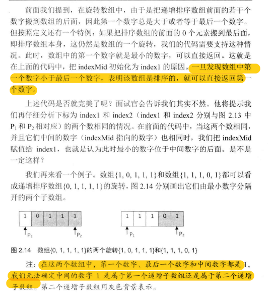
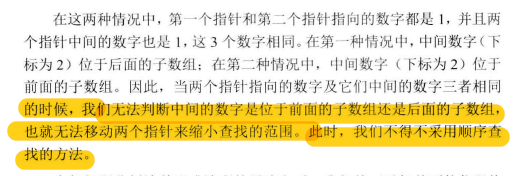

### 题目描述

把一个数组最开始的若干个元素搬到数组的末尾，我们称之为数组的旋转。 

输入一个递增排序的数组的一个旋转，输出旋转数组的最小元素。 例如数组{3,4,5,1,2}为{1,2,3,4,5}的一个旋转，该数组的最小值为1。

 **NOTE：给出的所有元素都大于0，若数组大小为0，请返回0。**

### 思路

总体二分：

- if mid大于high, low = mid - 1

- if mid小于high, high = mid

- 直到mid=high，取此位置的数

  ```python
  # __author__ = 'lenovo'
  
  def find_min(nums):
      if not nums:
          return False
  
      length = len(nums)
      left , right = 0, length-1
  
      # (1)如果数列第一个元素不大于等于最后一个元素，则第一个元素为最小
      while nums[left] >= nums[right]:
          if right - left == 1:
              return nums[right]
          mid = (left+right)/2
  
          # (2)如果第一个元素和中间元素和最后一个元素相等，无法使用二分法判断最小值
          if nums[left] == nums[mid] == nums[right]:
              return min(nums)
  
          if nums[left] <= nums[mid]:
              left = mid
          if nums[right] >= nums[mid]:
              right = mid
  
      return nums[0]
  
  if __name__ == '__main__':
      # 正常情况
      print(find_min([2, 2, 4, 5, 6, 2]))
      print(find_min([1, 0, 0, 1]))
      
      # 对应第一种情况
      print(find_min([0, 1, 2, 3, 4]))
  
      # 对应第二种情况
      print(find_min([1, 0, 1, 1, 1, 1]))
      print(find_min([1, 1, 1, 1, 0, 1]))
  ```

  不能使用二分有两种特殊情况：

  

