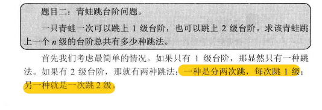

### 题目描述

一只青蛙一次可以跳上1级台阶，也可以跳上2级。求该青蛙跳上一个n级的台阶总共有多少种跳法（先后次序不同算不同的结果）。

### 思路

假设对于第n级台阶，总共有f(n)种跳法.

那么f(n) = f(n-1) + f(n-2)，其中f(1)=1,f(2)=2




```python
__author__ = 'lenovo'

def fib(n):
    if n<=1:
        return n
    a , b = 0 , 1
    for _ in range(n):
        a , b = b , a+b
    return a

def fib2(n):
    if n<=1:
        return n
    return fib2(n-1) + fib2(n-2)

print(fib(10))
print(fib2(10))
```


假设f(n)是n个台阶跳的次数。 

1. ​    f(1) = 1   
2. ​    f(2) 会有两个跳得方式，一次1阶或者2阶，这回归到了问题f(1),f(2) = f(2-1) + f(2-2)   
3. ​    f(3)       会有三种跳得方式，1阶、2阶、3阶，那么就是第一次跳出1阶后面剩下：f(3-1);第一次跳出2阶，剩下f(3-2)；第一次3阶，那么剩下f(3-3).因此结论是f(3)       = f(3-1)+f(3-2)+f(3-3)   
4. ​    f(n)时，会有n中跳的方式，1阶、2阶...n阶，得出结论：   

  f(n) = f(n-1)+f(n-2)+...+f(n-(n-1)) +   f(n-n) = f(n-1)+f(n-2)+...+f(1)+f(0)

f(n-1) = f(n-2)+f(n-3)+...+f(1)+f(0)

所以：f(n)-f(n-1) = f(n-1)

f(n) = 2*f(n-1)

于是：f(n-1)=2*f(n-2)....................................f(2)=2\*f(1)=2

所以：f(n) = 2^(n-1)


链接：

https://www.nowcoder.com/questionTerminal/6fbfb7eccc00415c8e4975da5fe3e0c1?toCommentId=381292

