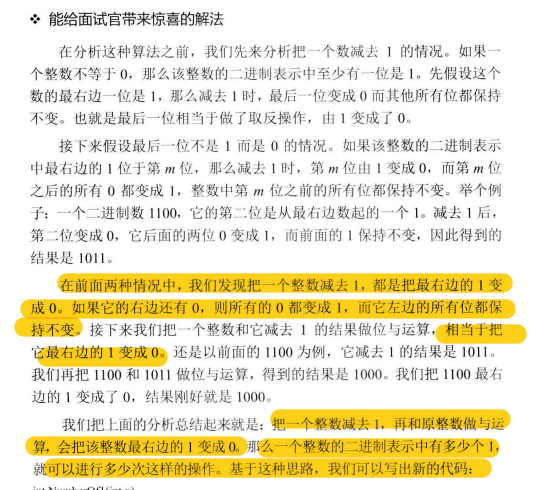

### 题目描述

给定一个整数，输出这个整数的二进制中1的个数。例如：给定7，其二进制表示111.因此输出结果为3.

负数用补码表示。

### 思路

#### 遇见负数引起死循环

但是负数使用补码表示的，对于负数，最高位为1，而负数在计算机是以补码存在的，往右移，符号位不变，符号位1往右移，最终可能会出现全1的情况，导致死循环。与0xffffffff相与，就可以消除负数的影响.

```python
def numberOf1(n):
    count = 0
    while n:
        if n&1:
            count += 1
        n>>=1
    return count

print(numberOf1(3))#2
print(numberOf1(7))#3
print(numberof1(-7))#死循环
```


```python
def numberOf2(n):
    count = 0
    flag = 1
    while flag<=abs(n):
        if n&flag:
            count += 1
        flag<<=1
    return count

print(numberOf2(-1))
```



二进制表示中，最后的那个1被减去后，该位变成0，低位都变为1，高位不变，与原来的数按位与就可以去掉这个1。

```python
def numberOf3(n):
    count = 0
    while n:
        count += 1
        # 把一个整数减去1，再和原整数做与运算，会把该整数最右边的一个1变成0
        # 有多少个1就能进行多少次转化
        n = n & (n-1)
        print(n)
    return count
```

目前这三种方法中只有常规解法对于负数可以得到正确结果。

最后一种方法看到网上都是这样写的，但是我在运行时一直得不到正确结果。

。。。。。。。