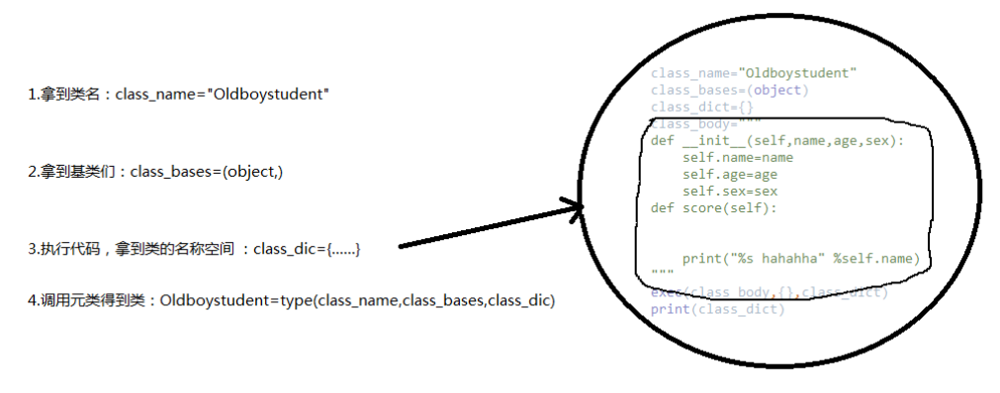

# 元类

什么是元类呢？一切源自于一句话：python中一切皆为对象。让我们先定义一个类，然后逐步分析

```python
class StanfordTeacher(object):
    school='Stanford'

    def __init__(self,name,age):
        self.name=name
        self.age=age

    def say(self):
        print('%s says welcome to the Stanford to learn Python' %self.name)
        
t1=StanfordTeacher('lili',18)
print(type(t1)) #查看对象t1的类是<class '__main__.StanfordTeacher'>
```

所有的对象都是实例化或者说调用类而得到的（调用类的过程称为类的实例化），比如对象t1是调用类StanfordTeacher得到的.

如果一切皆为对象，那么类StanfordTeacher本质也是一个对象，既然所有的对象都是调用类得到的，那么StanfordTeacher必然也是调用了一个类得到的，这个类称为元类。

**于是我们可以推导出===>产生StanfordTeacher的过程一定发生了：StanfordTeacher=元类(…)**

```python
print(type(StanfordTeacher)) 
# 结果为<class 'type'>，证明是调用了type这个元类而产生的StanfordTeacher，即默认的元类为type
```

**元类Type---实例化--->类StanfordTeacher-----实例化------->对象t1**

我们基于python中一切皆为对象的概念分析出：我们用class关键字定义的类本身也是一个对象，负责产生该对象的类称之为元类(元类可以简称为类的类),内置的元类为type

class关键字在帮我们创建类时，必然帮我们调用了元类StanfordTeacher=type(...).,那调用type时传入的参数是什么呢？必然是类的关键组成部分，一个类有三大组成部分，分别是

**1.类名class_name="StanfordTeacher"**

**2.基类们class_bases=(object,)**

**3.类的名称空间class_dic,类的名称空间是执行类体代码而得到的**

调用type时会依次传入以上三个参数

综上，class关键字帮我们创建一个类应该细分为以下四个过程


### 自定义元类控制类StanfordTeacher的创建

一个类没有声明自己的元类，默认他的元类就是type，除了使用内置元类type，我们也可以通过继承type来自定义元类，然后使用metaclass关键字参数为一个类指定元类。

```python
class Mymeta(type): #只有继承了type类才能称之为一个元类，否则就是一个普通的自定义类
    pass

# StanfordTeacher=Mymeta('StanfordTeacher',(object),{...})
class StanfordTeacher(object,metaclass=Mymeta): 
    school='Stanford'

    def __init__(self,name,age):
        self.name=name
        self.age=age

    def say(self):
        print('%s says welcome to the Stanford to learn Python' %self.name)
```

自定义元类可以控制类的产生过程，类的产生过程其实就是元类的调用过程,即`StanfordTeacher=Mymeta(‘StanfordTeacher’,(object),{…})`，调用Mymeta会先产生一个空对象StanfordTeacher，然后连同调用Mymeta括号内的参数一同传给Mymeta下的__init__方法，完成初始化，于是我们可以
```python
 class Mymeta(type): #只有继承了type类才能称之为一个元类，否则就是一个普通的自定义类
    def __init__(self,class_name,class_bases,class_dic):
        # print(self) #<class '__main__.StanfordTeacher'>
        # print(class_bases) #(<class 'object'>,)
        # print(class_dic) #{'__module__': '__main__', '__qualname__': 'StanfordTeacher', 'school': 'Stanford', '__init__': <function StanfordTeacher.__init__ at 0x102b95ae8>, 'say': <function StanfordTeacher.say at 0x10621c6a8>}
        super(Mymeta, self).__init__(class_name, class_bases, class_dic)  # 重用父类的功能

        if class_name.islower():
            raise TypeError('类名%s请修改为驼峰体' %class_name)

        if '__doc__' not in class_dic or len(class_dic['__doc__'].strip(' \n')) == 0:
            raise TypeError('类中必须有文档注释，并且文档注释不能为空')

# StanfordTeacher=Mymeta('StanfordTeacher',(object),{...})
class StanfordTeacher(object,metaclass=Mymeta): 
    """
    类StanfordTeacher的文档注释
    """
    school='Stanford'

    def __init__(self,name,age):
        self.name=name
        self.age=age

    def say(self):
        print('%s says welcome to the Stanford to learn Python' %self.name)

```

### \__call__

```python
class Foo:
    def __call__(self, *args, **kwargs):
        print(self)
        print(args)
        print(kwargs)

obj=Foo()
#1、要想让obj这个对象变成一个可调用的对象，需要在该对象的类中定义一个方法__call__方法，该方法会在调用对象时自动触发
#2、调用obj的返回值就是__call__方法的返回值
res=obj(1,2,3,x=1,y=2)
```

由上例得知，调用一个对象，就是触发对象所在类中的\_\_call\_\_方法的执行，如果把StanfordTeacher也当做一个对象，那么在StanfordTeacher这个对象的类中也必然存在一个\__call__方法

```python
class Mymeta(type): #只有继承了type类才能称之为一个元类，否则就是一个普通的自定义类
    def __call__(self, *args, **kwargs):
        print(self) #<class '__main__.StanfordTeacher'>
        print(args) #('lili', 18)
        print(kwargs) #{}
        return 123

class StanfordTeacher(object,metaclass=Mymeta):
    school='Stanford'

    def __init__(self,name,age):
        self.name=name
        self.age=age

    def say(self):
        print('%s says welcome to the Stanford to learn Python' %self.name)


# 调用StanfordTeacher就是在调用StanfordTeacher类中的__call__方法
# 然后将StanfordTeacher传给self,溢出的位置参数传给*，溢出的关键字参数传给**
# 调用StanfordTeacher的返回值就是调用__call__的返回值
t1=StanfordTeacher('lili',18)
print(t1) #123

```

默认地，调用t1=StanfordTeacher(‘lili’,18)会做三件事

1、产生一个空对象obj

2、调用__init__方法初始化对象obj

3、返回初始化好的obj

对应着，StanfordTeacher类中的__call__方法也应该做这三件事

```python
class Mymeta(type): #只有继承了type类才能称之为一个元类，否则就是一个普通的自定义类
    def __call__(self, *args, **kwargs): #self=<class '__main__.StanfordTeacher'>
        #1、调用__new__产生一个空对象obj
        obj=self.__new__(self) # 此处的self是类OldoyTeacher，必须传参，代表创建一个StanfordTeacher的对象obj

        #2、调用__init__初始化空对象obj
        self.__init__(obj,*args,**kwargs)

        #3、返回初始化好的对象obj
        return obj

class StanfordTeacher(object,metaclass=Mymeta):
    school='Stanford'

    def __init__(self,name,age):
        self.name=name
        self.age=age

    def say(self):
        print('%s says welcome to the Stanford to learn Python' %self.name)

t1=StanfordTeacher('lili',18)
print(t1.__dict__) #{'name': 'lili', 'age': 18}

```


```python
class Mymeta(type): #只有继承了type类才能称之为一个元类，否则就是一个普通的自定义类
    n=444

    def __new__(cls, *args, **kwargs):
        obj=type.__new__(cls,*args,**kwargs) # 必须按照这种传值方式
        print(obj.__dict__)
        # return obj # 只有在返回值是type的对象时，才会触发下面的__init__
        return 123

    def __init__(self,class_name,class_bases,class_dic):
        print('run。。。')


class StanfordTeacher(object,metaclass=Mymeta): #StanfordTeacher=Mymeta('StanfordTeacher',(object),{...})
    n=111

    school='Stanford'

    def __init__(self,name,age):
        self.name=name
        self.age=age

    def say(self):
        print('%s says welcome to the Stanford to learn Python' %self.name)


print(type(Mymeta)) #<class 'type'>
# 产生类StanfordTeacher的过程就是在调用Mymeta，而Mymeta也是type类的一个对象，那么Mymeta之所以可以调用，一定是在元类type中有一个__call__方法
# 该方法中同样需要做至少三件事：
# class type:
#     def __call__(self, *args, **kwargs): #self=<class '__main__.Mymeta'>
#         obj=self.__new__(self,*args,**kwargs) # 产生Mymeta的一个对象
#         self.__init__(obj,*args,**kwargs) 
#         return obj

```


参考：

转   [元类](https://blog.csdn.net/weixin_45706714/article/details/102768999)

[两句话掌握python最难知识点——元类](https://segmentfault.com/a/1190000011447445)

[类和对象的创建过程（元类，\__new__,\__init_\_,\__call__）](https://www.cnblogs.com/huchong/p/8260151.html)

图片来自 [关于自己对Python中元类的理解](<https://blog.csdn.net/luan7liem/article/details/82192104>)

​	