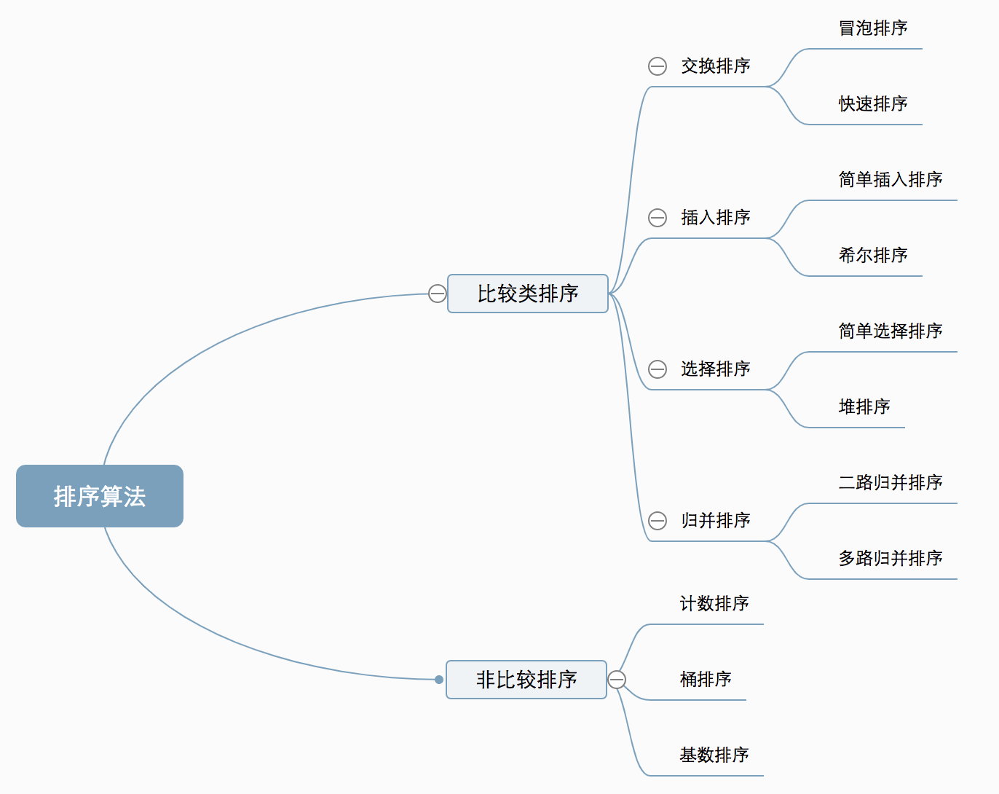
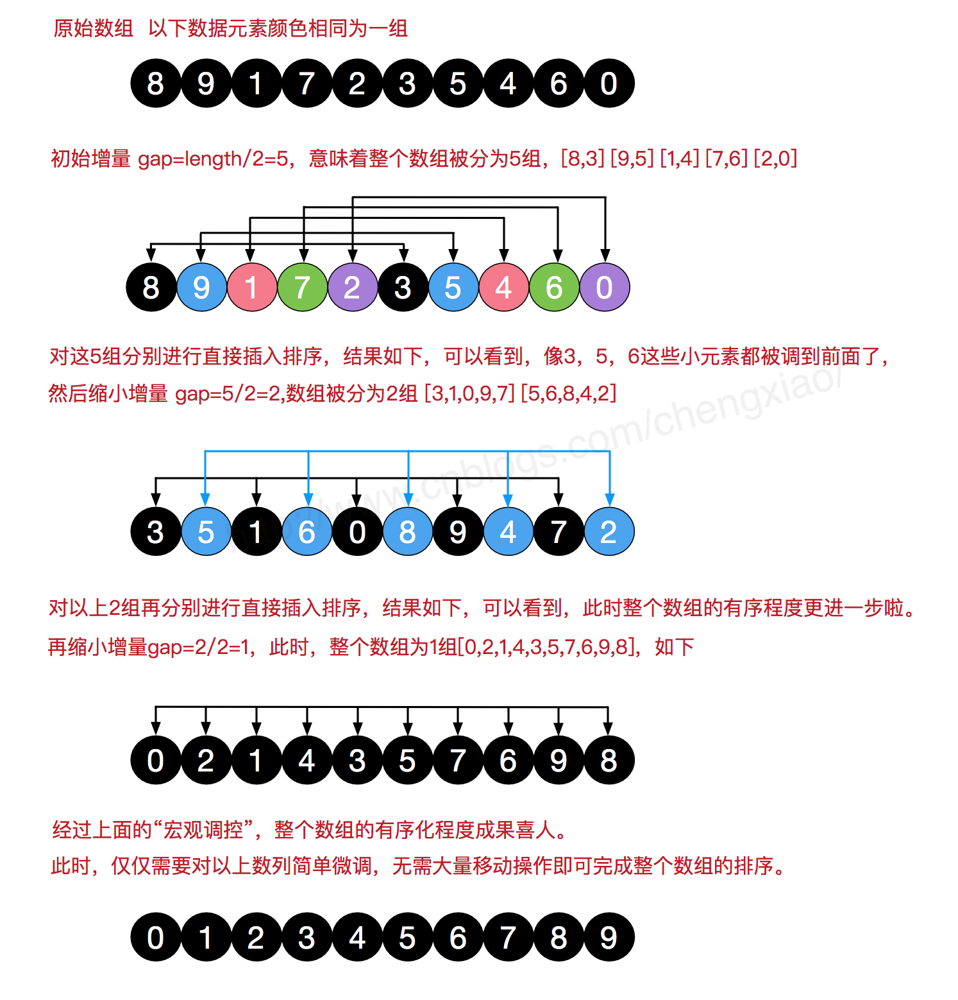

Python实现经典排序算法



### 一、冒泡排序

- 冒泡排序是排序算法中较为简单的一种，英文称为 Bubble Sort。它遍历所有的数据，每次对相邻元素进行两两比较，如果顺序和预先规定的顺序不一致，则进行位置交换；这样一次遍历会将最大或最小的数据上浮到顶端，之后再重复同样的操作，直到所有的数据有序。
- 如果有n个数据，那么需要的比较次数，**所以当数据量很大时，冒泡算法的效率并不高。**
- **当输入的数据是反序时，花的时间最长**，当输入的数据是正序时，时间最短。

```python
def bubble_sort(alist):
    length = len(alist)
    state = 1 #假设本次循环没有改变
    for i in range(length-1,0,-1):
        for j in range(i):
            if alist[j] > alist[j+1]:
                alist[j] , alist[j+1] = alist[j+1], alist[j]
                state = 0 # 有数值交换
        if state:
            break
    print(alist)

if __name__ == "__main__":
    alist = [2, 15, 5, 9, 7, 6, 4, 12, 5, 4, 2, 64, 5, 6, 4, 2, 3, 54, 45, 4, 44]
    bubble_sort(alist)
```

### 二、选择排序

- 选择排序简单直观，英文称为 Selection Sort，先在数据中找出最大或最小的元素，放到序列的起始；然后再从余下的数据中继续寻找最大或最小的元素，依次放到排序序列中，直到所有数据样本排序完成。很显然，选择排序也是一个费时的排序算法，无论什么数据，**都需要 O(n^2) 的时间复杂度**，不适宜大量数据的排序。
- 选择排序的主要优点与数据移动有关。如果某个元素位于正确的最终位置上，则它不会被移动。选择排序每次交换一对元素，它们当中至少有一个将被移到其最终位置上，因此对n个元素的表进行排序总共进行至多n-1次交换。
- 在所有的完全依靠交换去移动元素的排序方法中，选择排序属于非常好的一种.

```python
def selection_sort(alist):
    length = len(alist)
    for i in range(length):
        temp = alist[i]
        # 找到序列中最小的值
        for j in range(i+1,length):
            if temp > alist[j]:
                temp ,alist[j] = alist[j] , temp
        alist[i] = temp

    print(alist)
if __name__ == "__main__":
    alist = [2, 15, 5, 9, 7, 6, 4, 12, 5, 4, 2, 64, 5, 6, 4, 2, 3, 54, 45, 4, 44]
    selection_sort(alist)
```

### 三、插入排序

- 插入排序英文称为Insertion Sort，**它通过构建有序序列，对于未排序的数据序列，在已排序序列中从后向前扫描，找到相应的位置并插入**，类似打扑克牌时的码牌。插入排序有一种优化的算法，可以进行拆半插入。
- 基本思路是先将待排序序列的第一个元素看做一个有序序列，把第二个元素到最后一个元素当成是未排序序列；然后从头到尾依次扫描未排序序列，将扫描到的每个元素插入有序序列的适当位置，直到所有数据都完成排序；如果待插入的元素与有序序列中的某个元素相等，则将待插入元素插入到相等元素的后面。

```python
def insert_sort(alist):
    length = len(alist)
    for i in range(1,length):
        # 保证前i个序列是有序序列
        for j in range(i):
            if alist[j] > alist[i]:
                alist[j] , alist[i] = alist[i] ,alist[j]

    print(alist)
if __name__ == "__main__":
    alist = [2, 15, 5, 9, 7, 6, 4, 12, 5, 4, 2, 64, 5, 6, 4, 2, 3, 54, 45, 4, 44]
    insert_sort(alist)
```

### 四、快速排序

- 快速排序,英文称为Quicksort，又称划分交换排序partition-exchange sort简称快排。
- 快速排序使用分治策略来把一个序列分为两个子序列。**首先从数列中挑出一个元素，并将这个元素称为「基准」pivot。**重新排序数列，**所有比基准值小的元素摆放在基准前面，所有比基准值大的元素摆在基准后面，相同的数可以到任何一边。**在这个分区结束之后，该基准就处于数列的中间位置。这个称为分区partition操作。之后，在子序列中继续重复这个方法，直到最后整个数据序列排序完成。
- 在平均状况下，排序n个项目要 O(nlogn) 次比较。在最坏状况下则需要 O(n^2) 次比较，但这种状况并不常见。事实上，快速排序通常明显比其他算法更快，因为它的内部循环可以在大部分的架构上很有效率地达成。

```python
def quick_sort(alist,start,end):
    if start >= end:
        return
    # 每次序列第一个值为基准
    pivot = alist[start]
    low = start
    high = end
    # while 循环一遍，左边小于pivot，右边大于pivot
    while low < high:
        while low < high and pivot <= alist[high]:
            high -= 1
        alist[low] = alist[high]
        while low < high and alist[low] <= pivot:
            low += 1
        alist[high] = alist[low]

    alist[low] = pivot
    quick_sort(alist,start,low-1)
    quick_sort(alist,low+1,end)
    return alist

if __name__ == "__main__":
    alist = [2, 15, 5, 9, 7, 6, 4, 12, 5, 4, 2, 64, 5, 6, 4, 2, 3, 54, 45, 4, 44]
    print(quick_sort(alist,0,len(alist)-1))
```

**递归：**

```python
# 递归 
def q_sort(L, left, right):
    if left < right:
        pivot = Partition(L, left, right)

        q_sort(L, left, pivot - 1)
        q_sort(L, pivot + 1, right)
    return L

def Partition(L, left, right):
    pivotkey = L[left]

    while left < right:
        while left < right and L[right] >= pivotkey:
            right -= 1
        L[left] = L[right]
        while left < right and L[left] <= pivotkey:
            left += 1
        L[right] = L[left]

    L[left] = pivotkey
    return left

L = [5, 9, 1, 11, 6, 7, 2, 4]

print q_sort(L, 0, len(L) - 1)
```

**非递归：**

```python
def q_sort(L, left, right):
    if right<2:
        return L
    # 非递归，使用栈模拟
    stack = []
    stack.append(right)
    stack.append(left)
    while len(stack)>0:
        # 模拟左右边界
        left,right = stack.pop(),stack.pop()
        index = Partition(L,left,right)
        if left<index-1:
            stack.append(index-1)
            stack.append(left)
        if right>index+1:
            stack.append(right)
            stack.append(index+1)
    return L

def Partition(L, left, right):
    pivotkey = L[left]

    while left < right:
        while left < right and L[right] >= pivotkey:
            right -= 1
        L[left] = L[right]
        while left < right and L[left] <= pivotkey:
            left += 1
        L[right] = L[left]

    L[left] = pivotkey
    return left 

L = [5, 9, 1, 11, 6, 7, 2, 4]

print q_sort(L, 0, len(L) - 1)
```

###　五、希尔排序

- 希尔排序也称递减增量排序，实质是分组插入排序，是插入排序的一种改进版本，英文称为Shell Sort，**效率虽高，但它是一种不稳定的排序算法。**
- 插入排序在对几乎已经排好序的数据操作时，效果是非常好的；但是插入排序每次只能移动一位数据，因此插入排序效率比较低。
- 希尔排序在插入排序的基础上进行了改进，它的基本思路是**先将整个数据序列分割成若干子序列分别进行直接插入排序，待整个序列中的记录基本有序时，再对全部数据进行依次直接插入排序。**



```python
def shell_sort(alist):
    length = len(alist)
    # 步长
    gap = length//2

    while gap>0:
        for i in range(gap,length):
            j = i
            while (j-gap) >=0 and alist[j-gap] > alist[j]:
                alist[j-gap] , alist[j] = alist[j], alist[j-gap]
                j -= gap
        gap //= 2
    print(alist)

if __name__ == "__main__":
    alist = [2, 15, 5, 9, 7, 6, 4, 12, 5, 4, 2, 64, 5, 6, 4, 2, 3, 54, 45, 4, 44]
    shell_sort(alist)
```

### 六、归并排序

- 归并排序英文称为 Merge Sort，**它是采用分治法的一个非常典型的应用**。归并排序的思想就是先递归分解数组，再合并数组。
- 将数组分解最小之后，然后合并两个有序数组，基本思路是比较两个数组的最前面的数，谁小就先取谁，取了后相应的指针就往后移一位。然后再比较，直至一个数组为空，最后把另一个数组的剩余部分复制过来即可。
- **归并排序严格遵循从左到右或从右到左的顺序合并子数据序列, 它不会改变相同数据之间的相对顺序, 因此归并排序是一种稳定的排序算法。**

**步骤**

1. 递归分解，将数组分解成left和right。如果这两个数组内部数据是有序的（转向步骤2-4）；如果无序，则对数组进行二分，直至分解出的小组只有一个元素，此时认为该小组内部有序。

2. 合并两个有序数组，比较两个数组的最前面的数，谁小就先取谁，该数组的指针往后移一位。
3. 重复步骤2，直至一个数组为空。
4. 最后把另一个数组的剩余部分复制过来即可。

```python
def merge_sort(alist):
    length = len(alist)
    if length <= 1:
        return alist
    mid = length//2
    left = merge_sort(alist[:mid])
    right = merge_sort(alist[mid:])
    return sort(left,right)

def sort(left,right):
    left_length = len(left)
    right_length = len(right)
    result = []
    l , r = 0 , 0
    while l<left_length and r < right_length:
        if left[l] < right[r]:
            result.append(left[l])
            l+=1
        else :
            result.append(right[r])
            r+=1

    # while l<left_length:
    #     result.append(left(l))
    #     l += 1
    #
    # while r<right_length:
    #     result.append(right[r])
    #     r += 1
    result += left[l:]
    result += right[r:]
    return result

if __name__ == "__main__":
    alist = [2, 15, 5, 9, 7, 6, 4, 12, 5, 4, 2, 64, 5, 6, 4, 2, 3, 54, 45, 4, 44]
    print(merge_sort(alist))
```

### 七、堆排序

堆排序，英文称 Heapsort，是指利用堆这种数据结构所设计的一种排序算法。堆排序在 top K问题中使用比较频繁。堆排序是采用二叉堆的数据结构来实现的，虽然实质上还是一维数组。二叉堆是一个近似完全二叉树。

二叉堆具有以下性质：

- 父节点的键值总是大于或等于（小于或等于）任何一个子节点的键值。
- 每个节点的左右子树都是一个二叉堆（都是最大堆或最小堆）。

**步骤**

1. 根据初始数组取构建一个完全二叉树，保证所有的父节点比子节点的数值大。
2. 每次交换第一个和最后一个元素，输出最后一个元素（最大值），然后把剩下元素重新调整为最大堆。

```python 
def heap_adjust(arr,start,end):
    root = start
    while True:
        child = root * 2 + 1 # index从0开始，左子节点
        if child > end:
            break
        if child+1 <= end and arr[child] > arr[child+1]: # 从左右子节点中找到最小的元素
            child += 1

        if arr[root] > arr[child]:# 与父节点比较，取最小
            arr[root], arr[child] = arr[child], arr[root]
            root = child
        else:
            break
 
def heap_sort(arr):
    first=len(arr) // 2 - 1
    # 实现小顶堆
    for start in range (first, -1, -1):
        heap_adjust(arr, start, len(arr)-1)
    # 利用小顶堆实现从大到小排序
    for end in range (len(arr)-1, 0, -1):
        arr[0], arr[end] = arr[end], arr[0]
        heap_adjust(arr, 0, end-1)

if __name__ == "__main__":
    l = list(map(lambda x:int(x),input().split()))
    heap_sort(l)
    print(l)

```


转：

<https://www.cnblogs.com/Mufasa/p/10527387.html>

<https://blog.csdn.net/qq_32799165/article/details/87878876>

<https://www.cnblogs.com/chengxiao/p/6104371.html>